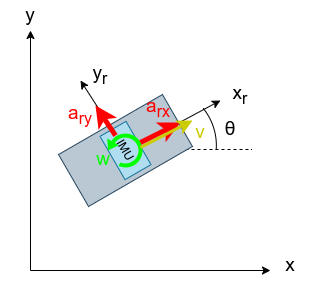

# RobotLocalization

拡張カルマンフィルタを使用したロボット自己位置推定のプログラム

---

## Overview

センサーはロボットの本体に取り付けたエンコーダから速度$v$, IMUから加速度$a_{rx}$, $a_{ry}$, 角速度$w$を取得する
それらの値からロボットの状態$(x, y, \theta)$を計算する



今回使用する状態方程式を以下に示す

```math
\bm{x_{k+1}} = \bm{f} \cdot \bm{x_k} + \bm{u_k}
```

```math
\bm{x}=\begin{pmatrix}
        x \\
        y \\
        \theta \\
        \dot{x} \\
        \dot{y} \\
        \dot{\theta}
    \end{pmatrix}

\quad

\bm{f}=\begin{bmatrix}
        1 & 0 & 0 & \Delta{t} & 0 & 0 \\
        0 & 1 & 0 & 0 & \Delta{t} & 0 \\
        0 & 0 & 1 & 0 & 0 & \Delta{t} \\
        0 & 0 & 0 & 1 & 0 & 0 \\
        0 & 0 & 0 & 0 & 1 & 0 \\
        0 & 0 & 0 & 0 & 0 & 1 
    \end{bmatrix}

\quad

\bm{u}=\begin{pmatrix}
        \frac{\Delta{t}^2}{2}(a_{rx}\cos{\theta}-a_{ry}\sin{\theta}) \\
        \frac{\Delta{t}^2}{2}(a_{rx}\sin{\theta}+a_{ry}\cos{\theta}) \\
        0 \\
        \Delta{t}(a_{rx}\cos{\theta}-a_{ry}\sin{\theta}) \\
        \Delta{t}(a_{rx}\sin{\theta}+a_{ry}\cos{\theta}) \\
        0
    \end{pmatrix}
```

今回使用する観測方程式を以下に示す

```math
\bm{y}=\bm{h}\cdot\bm{x}
```

```math
\bm{y}=\begin{pmatrix}
    v\cos{\theta} \\
    v\sin{\theta} \\
    w
    \end{pmatrix}

\quad

\bm{h}=\begin{bmatrix}
    0 & 0 & 0 & 1 & 0 & 0 \\
    0 & 0 & 0 & 0 & 1 & 0 \\
    0 & 0 & 0 & 0 & 0 & 1
    \end{bmatrix}
```

これらの方程式をもとに拡張カルマンフィルタの計算を実施する

#### 予測ステップ

```math
\bm{\check{x}_{k+1}}=\bm{f}\cdot\bm{x_k} + \bm{u_k}
\\
\bm{\check{P}_{k+1}}=\bm{F_k}\bm{P_k}\bm{F_k}^\top+\bm{Q_k}
```

#### 更新ステップ

```math
\bm{S_k}=\bm{H_k}\bm{\check{P}_{k+1}}\bm{H_k}^\top+\bm{R_k} \\
\bm{K_k}=\bm{\check{P}_{k+1}}\bm{H_k}^\top\bm{S_k}^{-1} \\
```

```math
\bm{x_{k+1}}=\bm{\check{x}_{k+1}}+\bm{K_k}(\bm{y_k}-\bm{h}\bm{\check{x}_{k+1}}) \\
\bm{P_{k+1}}=(\bm{I}-\bm{K_k}\bm{H_k})\bm{\check{P}_{k+1}}
```


## Usage

- 初期化処理

ロボット状態の初期値と分散値の初期値を設定する

```c++
// 状態値:
// [ x[m], y[m], th[rad], x'[m/s], y'[m/s], th'[rad/s] ]
float x[6] = {0.0f, 0.0f, 0.0f, 0.0f, 0.0f, 0.0f};
float P[6] = {0.01f, 0.01f, 0.01f, 0.01f, 0.01f, 0.01f};
float Q[6] = {0.01f, 0.01f, 0.01f, 0.01f, 0.01f, 0.01f};
float R[3] = {0.01f, 0.01f, 0.01f};
RobotLocalization::EKF ekf(
  x, // [x, y, th, x', y', th']
  P, // P
  Q, // Q
  R  // R
);
```

- 状態更新


```c++
// センサ取得値: 
// [ v[m/s], arx[m/s^2], ary[m/s^2], w[rad/s] ]
float y[4] = {0.25f, 0.0f, 0.0f, 1.0f};
// 更新時間(s)
float dt = 0.01;

memcpy(x, x_new, sizeof(float)*6);
ekf.update(x, y, dt, x_new);
```